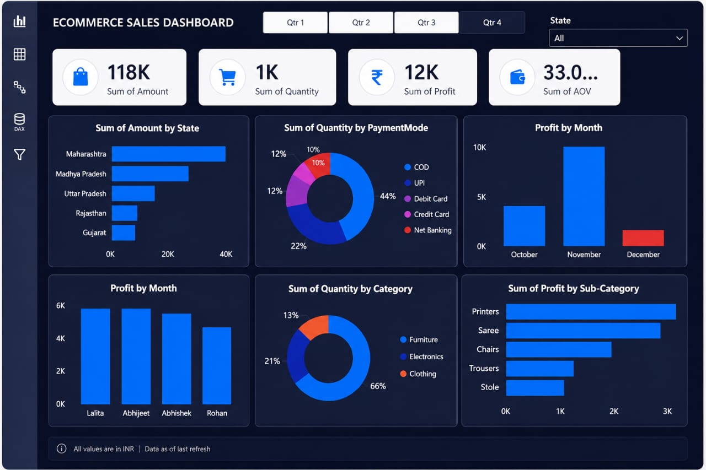

# e-commerce-sales-dashboard
Interactive Power BI dashboard to analyze ecommerce sales, profit, and customer trends across india.

📊 Ecommerce Sales Dashboard (Power BI)

🧾 Project Summary

Developed an interactive Ecommerce Sales Dashboard using Power BI to analyze sales performance, customer behavior, and product trends across India. The dashboard enables stakeholders to make data-driven decisions by providing actionable insights into revenue, profit, and demand patterns.
🎯 Business Problem

Ecommerce businesses often struggle to:
Track sales performance across regions
Identify high-performing products and categories
Understand customer purchasing behavior
Monitor profit trends over time
👉 This dashboard solves these challenges by providing a centralized analytical view of key business metrics.

💼 Key Responsibilities
Cleaned and transformed raw sales data for analysis
Built data model and established relationships
Created calculated measures using DAX
Designed interactive and visually appealing dashboard
Implemented filters and slicers for dynamic analysis

📈 Key Achievements / Insights
Identified Maharashtra as the top-performing state in sales
Discovered 66% of total quantity comes from a single category
Analyzed monthly profit trends, with peak performance in November
Highlighted top profit-generating sub-categories (Printers, Saree, Chairs)
Evaluated payment mode distribution, identifying dominant transaction method

🛠 Technical Skills Demonstrated
Power BI (Dashboard Development, Data Visualization)
DAX (Calculated Measures, KPIs)
Data Cleaning & Transformation
Data Modeling (Relationships, Schema Design)
Business Analysis & Insight Generation

🎛 Dashboard Features
📍 State-wise Sales Analysis
📅 Monthly Profit Trends
💳 Payment Mode Distribution
📦 Category-wise Quantity Analysis
🛍 Sub-category Profit Breakdown
🎯 Interactive Filters (Quarter, State)
📷 Dashboard Preview

Markdown

📁 Project Structure
ecommerce-sales-dashboard.pbix → Main dashboard file
dashboard-preview.png → Dashboard snapshot

🚀 Impact
Improved visibility of sales and profit trends
Enabled quick identification of high-performing regions and products
Supported better decision-making for inventory and marketing strategies

🔮 Future Enhancements
Integrate real-time data sources
Add customer segmentation analysis
Implement advanced DAX calculations
Enhance UI/UX for better storytelling

👨‍💻 Author
Karanjot Buttar
